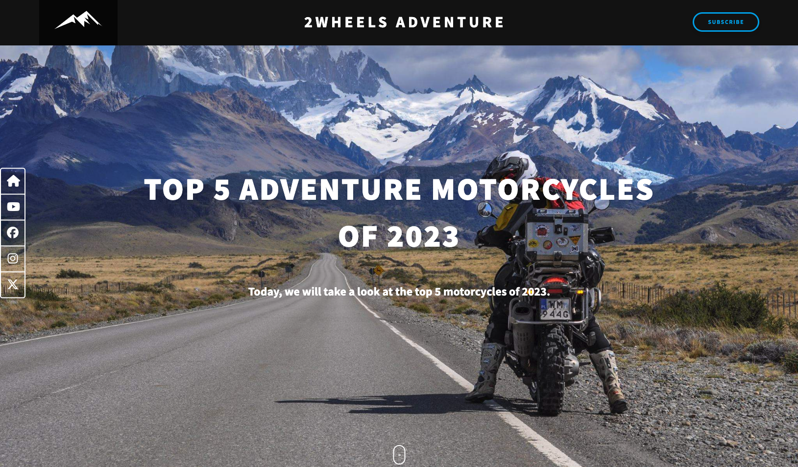

# Landing Page Challenge

This is my first landing page. I'm currently taking a Full Stack Web Development course at [FLAG](https://flag.pt/curso/full-stack-web-developer/), and this landing page borns as a 15 days challenge after the HTML and CSS modules.

Building this project was a lot of fun, and the more I progressed, the more engaged I was. I'm currently becoming more and more passionate about Web Development, and hope to being able to showcase here many more projects.

## Table of Contents

- [Overview](#Overview)
  - [The Challenge](#the-challenge)
  - [Screenshot](#screenshot)
  - [Links](#links)
-[My process](#my-process)
  -[Built with](#built-with) 

## Overview

### The Challenge

### Screenshot

### Links

- Live Site URL: [https://allavezz.github.io/15daysLandingPage/](https://allavezz.github.io/15daysLandingPage/)

## My process

### Built with

- Semantic HTML5 markup
- CSS custom properties
- Flexbox
- CSS Grid
- SASS Compiler
- JavaScript

